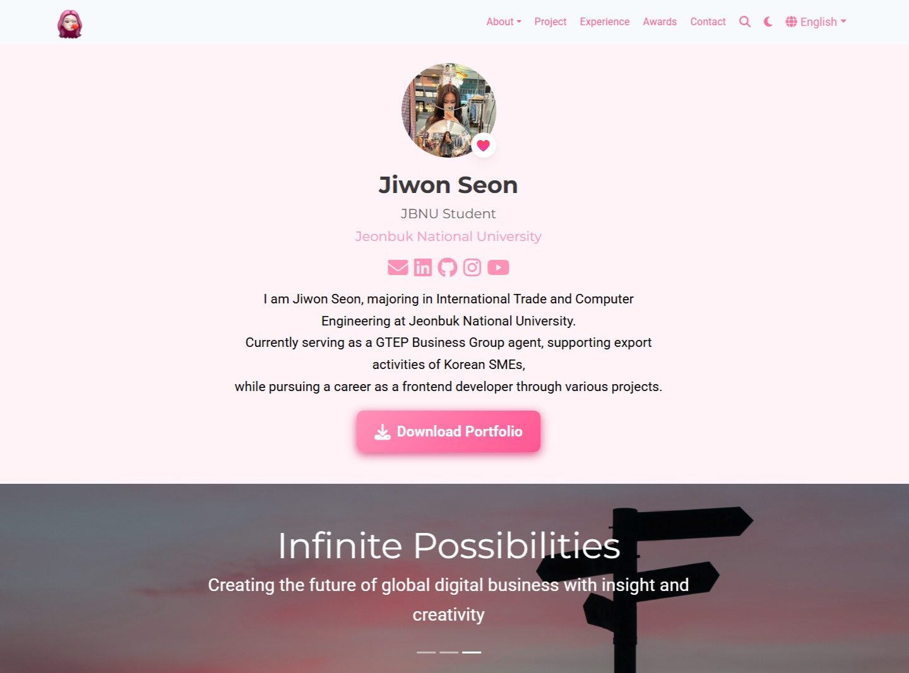

# Jiwon's Portfolio

## 👋 안녕하세요!

전북대학교에서 **무역학**과 **컴퓨터공학**을 전공하고 있는 **선지원**입니다.

글로벌 비즈니스와 기술의 융합에 열정을 가지고 있으며, 현재 대한민국 중소기업의 수출 활동을 지원하는 **GTEP 요원**으로 활동하면서 **프론트엔드 개발자**로서의 커리어를 준비하고 있습니다.

## 🌟 사이트 소개

이 포트폴리오에서는 다음 내용을 확인하실 수 있습니다:
- 💻 **웹 개발 프로젝트** - React, Next.js, TypeScript 기반 애플리케이션
- 🌏 **글로벌 무역 경험** - 국제 무역 박람회 참가 및 수출 마케팅
- 🏆 **수상 및 성과** - 학업 우수상 및 프로젝트 경진대회 수상
- 🛠️ **기술 스택** - 사용하는 프론트엔드 기술 및 디자인 도구

## 🚀 주요 프로젝트

### [NearDeal](https://near-deal.vercel.app/)
실시간 O2O 서비스를 제공하는 학생 맞춤형 제휴 할인 큐레이션 플랫폼

### [IndieNBob](https://indie-n-bob.vercel.app/)
인디 뮤지션과 팬을 연결하는 커뮤니티 플랫폼

### [PAi](https://ai-todo-app-beta.vercel.app/)
AI 챗봇 메이트와 함께하는 일정관리 서비스 및 자동 일기 작성 기능

## 🛠️ 기술 스택

**Frontend:** React, Next.js, TypeScript, Tailwind CSS  
**상태 관리:** Zustand, Redux, React Query  
**Database:** MySQL  
**협업 툴:** Git/GitHub, Figma, Notion

## 📬 연락처

- **이메일:** [boywonderof@jbnu.ac.kr](mailto:boywonderof@jbnu.ac.kr)
- **GitHub:** [@oneieo](https://github.com/oneieo)
- **LinkedIn:** [선지원](https://www.linkedin.com/in/%EC%A7%80%EC%9B%90-%EC%84%A0-467467366/)
- **Instagram:** [@oneieo](https://www.instagram.com/oneieo)

## 🌐 포트폴리오 방문하기

👉 **[라이브 사이트](https://oneieo.github.io/portfolio/)**

한국어와 영어 버전으로 제공됩니다:
- 🇰🇷 한국어: [https://oneieo.github.io/portfolio/ko/](https://oneieo.github.io/portfolio/ko/)
- 🇬🇧 English: [https://oneieo.github.io/portfolio/en/](https://oneieo.github.io/portfolio/en/)

## 🏗️ 사용 기술

이 포트폴리오는 강력한 오픈소스 웹사이트 빌더인 [Hugo Blox Builder](https://hugoblox.com) (구 Wowchemy)를 사용하여 제작되었습니다.

### 주요 특징
- ⚡ Hugo를 활용한 빠른 정적 사이트 생성
- 📱 완전한 반응형 디자인
- 🎨 커스터마이징 가능한 테마 및 레이아웃
- 🔍 SEO 최적화
- 🌍 다국어 지원 (한국어/영어)
- 📊 Google Search Console 연동

## 📄 라이선스

Copyright © 2025 선지원. 이 포트폴리오는 [MIT License](LICENSE) 하에 배포됩니다.

---

**최종 업데이트:** 2025년 10월
